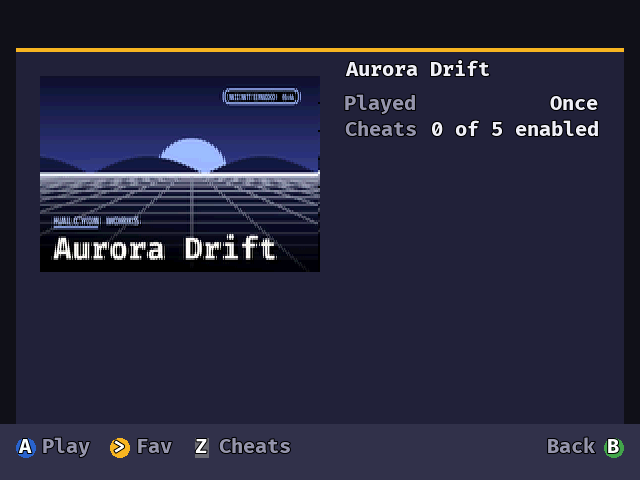
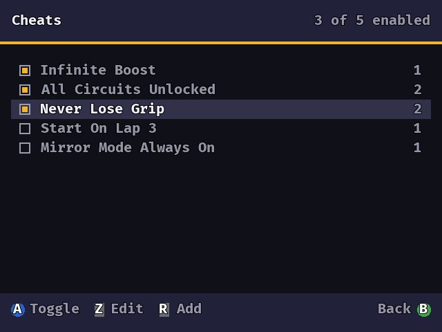
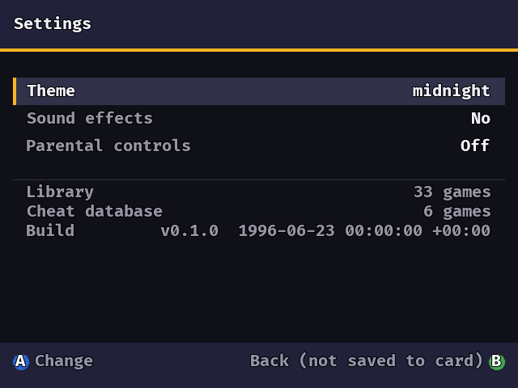

# MainMenu

A box-art game launcher for the N64, run from a [SummerCart64](https://github.com/Polprzewodnikowy/SummerCart64) flashcart.

Put your games on an SD card in whatever arrangement suits you, and the menu presents them as
**games rather than files**: a grid of covers you scroll through, that remembers what you played
and how long for. There is nothing to prepare in advance and no list to hand-write.

> [!IMPORTANT]
> **This has never run on a real console.** Everything below was developed and measured under
> [ares](https://ares-emu.net/), an emulator. Please read [What is not done](#what-is-not-done)
> before putting it on hardware.

| | |
|---|---|
|  |  |
| The grid. The bar on the right is your position; the yellow corner marks a favourite. | The detail sheet: what you have played, and how many cheats are switched on. |
|  |  |
| Cheats, as named groups rather than raw codes. | Settings, and what the menu found on your card. |

**Every game, every cover and every cheat above is invented.**
[`tools/mkdemo.py`](tools/mkdemo.py) draws original box art for titles that do not exist, so
nothing on this page belongs to anyone else.

---

## What it does

- **A tabbed grid of covers.** Tabs come from what a file *is*, not what folder it sits in, and a
  tab you have nothing for is not shown at all.
- **Favourites, recently played and most played**, kept by the game rather than by its filename —
  so rearranging your card does not lose them.
- **Covers from anywhere.** Drop an image next to a game, or use a bulk art pack, or both.
- **Cheats**, as named groups you tick rather than codes you type. You can add your own for
  anything the shipped database does not cover.
- **Parental controls.** A short button code, a padlock on whichever games you choose, and an
  optional window of the day when games will start. Locked games stay in the grid and ask for the
  code when launched — they are never hidden.
- **Other systems.** NES, SNES, Game Boy, Game Boy Color, Master System and Game Gear all launch
  through emulator cores, if you put the cores on the card.
- **Four themes** — midnight, phosphor, purple and red. Chosen in settings, though the choice
  currently lasts only until you switch the console off.

## Setting up a card

Only the first line is required. Everything else is optional, and leaving it out costs you exactly
that one feature and nothing else.

```
/sc64menu.n64                              the menu itself
/roms/**                                   your games, in any arrangement you like
/menu/emulators/…                          cores for the non-N64 systems
/menu/cheats.db                            the cheat database
/menu/metadata/…                           a downloaded box-art pack
/menu/cache/                               created by the menu; do not hand-edit
```

**How you arrange your games is up to you.** The menu walks `/roms` and everything under it, four
levels deep, and works out what each file is by reading it. Subfolders, naming and nesting are all
free. A folder per system is a reasonable habit and nothing more than that.

| system | file types |
|---|---|
| N64 | `.z64` `.n64` `.v64` `.rom` |
| NES | `.nes` |
| SNES | `.sfc` `.smc` |
| Game Boy / Color | `.gb` / `.gbc` |
| Master System / Game Gear | `.sms` `.gg` `.sg` |

Anything else is ignored, which is what lets cover images and save files sit in the same folders
as the games.

### Covers

A cover can be a file you dropped next to a game or one from a bulk pack, and they are looked at
in a fixed order. **A file you placed always beats the pack**, deliberately: a pack is something
you downloaded, a file you put there is a decision, and the decision should win.

| | where | example |
|---|---|---|
| 1 | an image named for the **game code**, anywhere under `/roms` | `NLAE.png` |
| 2 | an image named for the **game file**, anywhere under `/roms` | `Lantern Reef.jpg` |
| 3 | the art pack, for your exact region | `/menu/metadata/N/L/A/E/boxart_front.png` |
| 4 | the art pack, any region | `/menu/metadata/N/L/A/boxart_front.png` |
| 5 | the art pack, flat | `/menu/metadata/NLAE.png` |

Worth knowing:

- Loose images can be **`.png`, `.jpg` or `.jpeg`**. An art pack is read as **`.png` only**.
- JPEGs must be **baseline, not progressive**. Progressive is the one kind that cannot be read at
  all, and the cover simply comes up blank. If a card full of art shows nothing, check this first:
  `magick in.jpg -interlace none out.jpg`, or re-save with "progressive" unticked.
- A **half-downloaded image** is not detected — it draws a part-blank cover. Download it again and
  the menu will notice the file changed and redo it.
- Case and extension are ignored, so `nlae.JPG` and `NLAE.png` are the same thing. If two files
  could both match, the one in the shallower folder wins.
- Options 1 and 3–5 need an N64 game code, which **NES, SNES, Game Boy, Master System and Game
  Gear titles do not have**. Option 2 is the one that works for them: name the image after the
  game file.
- Any size and either shape is fine — everything is scaled and cropped on the way in.
- A game with no cover gets a plain tile with its name on it. That is how it is meant to look, not
  a sign that something is missing.

The first time a card is read, each cover takes **about a quarter of a second**, and longer for a
very large image. This happens once: covers are saved into `/menu/cache` and every later start
reads them straight back. Expect the grid to fill in over the first minute on a new card.

### Cheats

`/menu/cheats.db` is the cheat database for N64 games. It is built from
[libretro's cheat collection](https://github.com/libretro/libretro-database) with
`tools/mkcheatdb.py --fetch`, and is not part of the download.

**Cheats are switched on as named groups, never line by line.** Many cheats are two codes that
only work together, and offering half of one silently changes the wrong thing in the game. You can
also enter your own from the menu, which is the only option for the emulated systems and for
anything newer than the collection.

### Emulator cores

```
/menu/emulators/{neon64bu.rom,lithium64.z64,gb.v64,gbc.v64,smsPlus64.z64}
```

SNES games run on [lithium64](https://github.com/UsaRandom/lithium64), a fork of sodium64 aimed at
this console, falling back to `sodium64.z64` if that is what you have.

## What is not done

- **It has never run on a real console.** Every measurement was taken under an emulator. The
  first open question is whether the menu boots on a console at all; if it does not, nothing else
  here matters. The rest are listed in [AUDIT.md](docs/AUDIT.md).
- **Nothing has ever been written to a real SD card.** Favourites, play history, parental locks,
  the cover cache and cheat choices are all saved through one layer, and under the emulator the
  card is read-only, so that layer has never run for real. It has been tested against real files
  on a PC, which is not the same thing.
- **The development cart has no working USB**, so there is currently no way to get information
  back off a console. See [HARDWARE.md](docs/HARDWARE.md).

**Not supported:** the ED64 and 64Drive carts, and the music player. This aims at one cart on one
console. If you want broad flashcart support,
[upstream](https://github.com/Polprzewodnikowy/N64FlashcartMenu) is actively maintained and does
that job properly.

## Building it yourself

See [BUILDING.md](docs/BUILDING.md).

## Documentation

- [AUDIT.md](docs/AUDIT.md) — every measurement, every dead end, every wrong turn. Append-only.
- [DESIGN.md](docs/DESIGN.md) — layout geometry, and where the design and the code disagree.
- [HARDWARE.md](docs/HARDWARE.md) — the order to bring hardware up in, and why that order.
- [BUILDING.md](docs/BUILDING.md) — toolchain, build knobs, fixtures and the regression suite.

The numbered guides under [`docs/`](docs/) are inherited from upstream and describe upstream's
behaviour. Some of them — the file browser and music player pages in particular — document
features this version removed.

---

# Licence

Released under the [GNU Affero General Public License](LICENSE.md), inherited from upstream.

Substantially the work of the N64FlashcartMenu authors and
[contributors](https://github.com/Polprzewodnikowy/N64FlashcartMenu/graphs/contributors); this
fork replaces the presentation layer and takes responsibility for its own bugs.

* [Mateusz Faderewski / Polprzewodnikowy](https://github.com/Polprzewodnikowy)
* [Robin Jones / NetworkFusion](https://github.com/networkfusion)

Not affiliated with or endorsed by any console or cartridge maker, or by the upstream project. The GitHub Actions
workflows are upstream's and have not been adapted — the build artifact is still labelled for a
flashcart this fork no longer supports.

# Open source software and licences used

## Libraries
* [libdragon](https://github.com/DragonMinded/libdragon/tree/preview) - [UNLICENSE License](https://github.com/DragonMinded/libdragon/blob/preview/LICENSE.md)
* [libspng](https://github.com/randy408/libspng) - [BSD 2-Clause License](https://github.com/randy408/libspng/blob/master/LICENSE)
* [miniz](https://github.com/richgel999/miniz) - [MIT License](https://github.com/richgel999/miniz/blob/master/LICENSE)
* [minimp3](https://github.com/lieff/minimp3) - [CC0 1.0 Universal](https://github.com/lieff/minimp3/blob/master/LICENSE) — still vendored as a submodule, no longer compiled

## Sounds
See [License](https://pixabay.com/en/service/license-summary/) for the following sounds:
* [Cursor sound](https://pixabay.com/en/sound-effects/click-buttons-ui-menu-sounds-effects-button-7-203601/) by Skyscraper_seven (Free to use)
* [Actions (Enter, Back) sound](https://pixabay.com/en/sound-effects/menu-button-user-interface-pack-190041/) by Liecio (Free to use)
* [Error sound](https://pixabay.com/en/sound-effects/error-call-to-attention-129258/) by Universfield (Free to use)

See [License](https://creativecommons.org/licenses/by/4.0/) for the following sounds:
* [Background Music](https://www.playonloop.com/2017-music-loops/flying-dreams/) POL-flying-dreams-short

## Emulators
* [neon64v2](https://github.com/hcs64/neon64v2) by *hcs64* - [ISC License](https://github.com/hcs64/neon64v2/blob/master/LICENSE.txt)
* [sodium64](https://github.com/Hydr8gon/sodium64) by *Hydr8gon* - [GPL-3.0 License](https://github.com/Hydr8gon/sodium64/blob/master/LICENSE)
* [gb64](https://github.com/lambertjamesd/gb64) by *lambertjamesd* - [MIT License](https://github.com/lambertjamesd/gb64/blob/master/LICENSE)
* [smsPlus64](https://github.com/fhoedemakers/smsplus64) by *fhoedmakers* - [GPL-3.0 License](https://github.com/fhoedemakers/smsplus64/blob/main/LICENSE)
* [Press-F-Ultra](https://github.com/celerizer/Press-F-Ultra) by *celerizer* - [MIT License](https://github.com/celerizer/Press-F-Ultra/blob/master/LICENSE)

## Fonts
* [Firple](https://github.com/negset/Firple) by *negset* - (SIL Open Font License 1.1)
