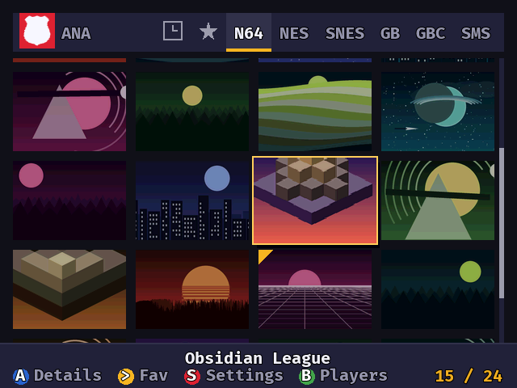
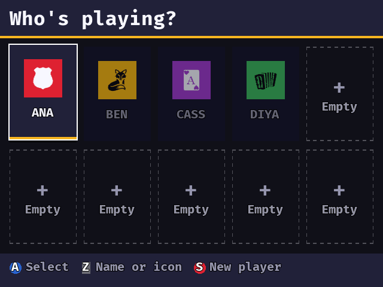

# MainMenu

A box-art launcher for the N64, run from a [SummerCart64](https://github.com/Polprzewodnikowy/SummerCart64).

Put `sc64menu.n64` in the root of an SD card and your games anywhere on it. The menu finds them, matches covers, and launches N64 titles plus NES, SNES, GB, GBC and SMS through cores kept on the card. Up to ten people can share one card, each with their own saves, favourites, history and theme.

Both pictures are of invented games: [`tools/mkdemo.py`](tools/mkdemo.py) draws the art, so this page ships nobody else's covers. The faces come from [game-icons.net](https://game-icons.net) and are credited in [CREDITS.md](docs/CREDITS.md).

- **Setting up a card:** [CARD.md](docs/CARD.md) — start here
- **Building from source:** [BUILDING.md](docs/BUILDING.md)
- Also [CREDITS.md](docs/CREDITS.md), [DESIGN.md](docs/DESIGN.md), [AUDIT.md](docs/AUDIT.md)

Forked from [N64FlashcartMenu](https://github.com/Polprzewodnikowy/N64FlashcartMenu) @ `6407ab15`. The boot and flashcart plumbing is theirs; the presentation layer is not. Their user guide is in [`docs/attic/upstream/`](docs/attic/upstream/) if you need it; it describes a menu this is not.

# Licence

Copyright © 2026 UsaRandom, and the N64FlashcartMenu contributors this is forked from. Released under the [GNU Affero General Public License](LICENSE.md), version 3 or later. There is no warranty; see sections 15 and 16.

Substantially the work of the N64FlashcartMenu authors and [contributors](https://github.com/Polprzewodnikowy/N64FlashcartMenu/graphs/contributors). This fork takes responsibility for its own bugs.

* [Mateusz Faderewski / Polprzewodnikowy](https://github.com/Polprzewodnikowy)
* [Robin Jones / NetworkFusion](https://github.com/networkfusion)

Not affiliated with or endorsed by any console or cartridge maker, or by the upstream project. The GitHub Actions workflows are still upstream's; the artifact they label is for a flashcart this fork does not support.

## Libraries
* [libdragon](https://github.com/DragonMinded/libdragon/tree/preview) - [UNLICENSE License](https://github.com/DragonMinded/libdragon/blob/preview/LICENSE.md)
* [libspng](https://github.com/randy408/libspng) - [BSD 2-Clause License](https://github.com/randy408/libspng/blob/master/LICENSE)
* [miniz](https://github.com/richgel999/miniz) - [MIT License](https://github.com/richgel999/miniz/blob/master/LICENSE)
* [midi64](src/libs/midi64) - [MIT License](src/libs/midi64/LICENSE) — vendored, not a submodule
* [svg64](src/libs/svg64) - [MIT License](src/libs/svg64/LICENSE) — vendored, not a submodule
* [picojpeg](src/libs/picojpeg) - public domain, by Rich Geldreich

Linked through libdragon rather than chosen here:

* [FatFs](http://elm-chan.org/fsw/ff/) by *ChaN* - [its own licence](libdragon/src/fatfs/License.md)
* [libcart](https://github.com/devwizard64/libcart) by *devwizard64* - the flashcart driver. The copy inside libdragon states no licence terms.

## Icons
3,894 icons from [game-icons.net](https://game-icons.net), [CC BY 3.0](https://creativecommons.org/licenses/by/3.0/) (a few authors CC0). Authors are named in [CREDITS.md](docs/CREDITS.md) and on the credits screen. Source is in [`assets/icons/`](assets/icons/). 286 icons from the original corpus were left out because they depict someone else's property; that does not change what is owed for the rest.

## Data
The database that recognises a cartridge and knows how it saves is derived from [ares](https://ares-emu.net)' own, ISC licensed, copyright © 2004-2025 ares team, Near et al. The cheat corpus, where a build ships one, is [libretro-database](https://github.com/libretro/libretro-database), MIT.

## Sounds
See [License](https://pixabay.com/en/service/license-summary/) for the following sounds:
* [Cursor sound](https://pixabay.com/en/sound-effects/click-buttons-ui-menu-sounds-effects-button-7-203601/) by Skyscraper_seven (Free to use)
* [Actions (Enter, Back) sound](https://pixabay.com/en/sound-effects/menu-button-user-interface-pack-190041/) by Liecio (Free to use)
* [Error sound](https://pixabay.com/en/sound-effects/error-call-to-attention-129258/) by Universfield (Free to use)

## Music
The 28 songs in [`assets/music/`](assets/music/) are CC0.

## Emulators
* [neon64v2](https://github.com/hcs64/neon64v2) by *hcs64* - [ISC License](https://github.com/hcs64/neon64v2/blob/master/LICENSE.txt)
* [sodium64](https://github.com/Hydr8gon/sodium64) by *Hydr8gon* - [GPL-3.0 License](https://github.com/Hydr8gon/sodium64/blob/master/LICENSE)
* [gb64](https://github.com/lambertjamesd/gb64) by *lambertjamesd* - [MIT License](https://github.com/lambertjamesd/gb64/blob/master/LICENSE)
* [smsPlus64](https://github.com/fhoedemakers/smsplus64) by *fhoedmakers* - [GPL-3.0 License](https://github.com/fhoedemakers/smsplus64/blob/main/LICENSE)
* [Press-F-Ultra](https://github.com/celerizer/Press-F-Ultra) by *celerizer* - [MIT License](https://github.com/celerizer/Press-F-Ultra/blob/master/LICENSE)

## Fonts
* [Firple](https://github.com/negset/Firple) by *negset* - (SIL Open Font License 1.1)
